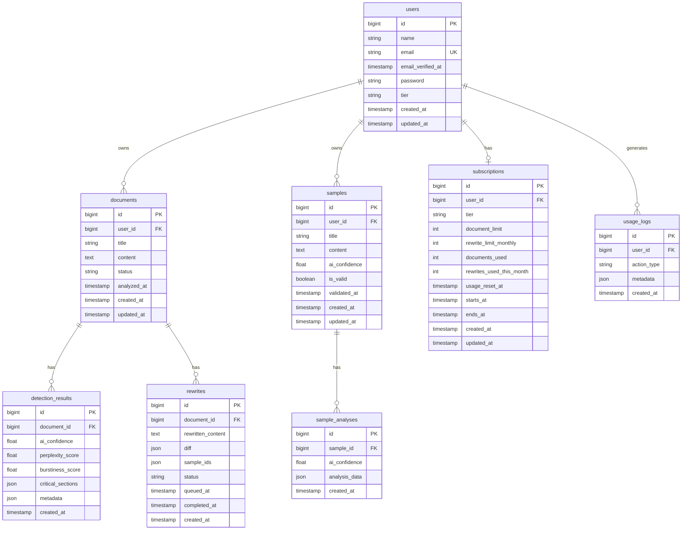

# Database Schema

## Overview

PostgreSQL database schema for the Humanizer application with proper relationships, indexes, and constraints.

## Entity Relationship Diagram



## Table Definitions

### users

Standard Laravel users table with tier information.

```sql
CREATE TABLE users (
    id BIGSERIAL PRIMARY KEY,
    name VARCHAR(255) NOT NULL,
    email VARCHAR(255) UNIQUE NOT NULL,
    email_verified_at TIMESTAMP NULL,
    password VARCHAR(255) NOT NULL,
    tier VARCHAR(50) DEFAULT 'free' NOT NULL,
    remember_token VARCHAR(100) NULL,
    created_at TIMESTAMP NULL,
    updated_at TIMESTAMP NULL
);

CREATE INDEX idx_users_tier ON users(tier);
CREATE INDEX idx_users_email ON users(email);
```

**Columns**:
- `tier`: 'free' or 'pro' - determines feature access

### documents

User-submitted documents for analysis and rewriting.

```sql
CREATE TABLE documents (
    id BIGSERIAL PRIMARY KEY,
    user_id BIGINT NOT NULL REFERENCES users(id) ON DELETE CASCADE,
    title VARCHAR(255) NOT NULL,
    content TEXT NOT NULL,
    status VARCHAR(50) DEFAULT 'pending' NOT NULL,
    analyzed_at TIMESTAMP NULL,
    created_at TIMESTAMP NULL,
    updated_at TIMESTAMP NULL
);

CREATE INDEX idx_documents_user_id ON documents(user_id);
CREATE INDEX idx_documents_status ON documents(status);
CREATE INDEX idx_documents_created_at ON documents(created_at DESC);
```

**Columns**:
- `status`: 'pending', 'analyzed', 'rewriting', 'completed', 'failed'
- `analyzed_at`: Timestamp when AI detection completed

### samples

User writing samples used as style reference for rewriting.

```sql
CREATE TABLE samples (
    id BIGSERIAL PRIMARY KEY,
    user_id BIGINT NOT NULL REFERENCES users(id) ON DELETE CASCADE,
    title VARCHAR(255) NOT NULL,
    content TEXT NOT NULL,
    ai_confidence DECIMAL(5,2) NULL,
    is_valid BOOLEAN DEFAULT true NOT NULL,
    validated_at TIMESTAMP NULL,
    created_at TIMESTAMP NULL,
    updated_at TIMESTAMP NULL
);

CREATE INDEX idx_samples_user_id ON samples(user_id);
CREATE INDEX idx_samples_is_valid ON samples(is_valid);
```

**Columns**:
- `ai_confidence`: 0-100, percentage of AI-generated content detected
- `is_valid`: False if sample is too AI-generated (>30% threshold)
- `validated_at`: When sample was analyzed for AI content

### detection_results

AI detection analysis results for documents.

```sql
CREATE TABLE detection_results (
    id BIGSERIAL PRIMARY KEY,
    document_id BIGINT NOT NULL REFERENCES documents(id) ON DELETE CASCADE,
    ai_confidence DECIMAL(5,2) NOT NULL,
    perplexity_score DECIMAL(10,4) NOT NULL,
    burstiness_score DECIMAL(10,4) NOT NULL,
    critical_sections JSON NULL,
    metadata JSON NULL,
    created_at TIMESTAMP NULL
);

CREATE INDEX idx_detection_results_document_id ON detection_results(document_id);
CREATE INDEX idx_detection_results_ai_confidence ON detection_results(ai_confidence);
```

**Columns**:
- `ai_confidence`: 0-100, overall AI detection score
- `perplexity_score`: Text predictability metric
- `burstiness_score`: Sentence complexity variation metric
- `critical_sections`: JSON array of text ranges with high AI probability
  ```json
  [
    {"start": 0, "end": 150, "confidence": 92.5, "reason": "Low perplexity"},
    {"start": 300, "end": 450, "confidence": 88.3, "reason": "Repetitive patterns"}
  ]
  ```
- `metadata`: Additional analysis data

### rewrites

Rewritten versions of documents.

```sql
CREATE TABLE rewrites (
    id BIGSERIAL PRIMARY KEY,
    document_id BIGINT NOT NULL REFERENCES documents(id) ON DELETE CASCADE,
    rewritten_content TEXT NOT NULL,
    diff JSON NULL,
    sample_ids JSON NOT NULL,
    status VARCHAR(50) DEFAULT 'queued' NOT NULL,
    queued_at TIMESTAMP NULL,
    completed_at TIMESTAMP NULL,
    created_at TIMESTAMP NULL
);

CREATE INDEX idx_rewrites_document_id ON rewrites(document_id);
CREATE INDEX idx_rewrites_status ON rewrites(status);
CREATE INDEX idx_rewrites_queued_at ON rewrites(queued_at);
```

**Columns**:
- `status`: 'queued', 'processing', 'completed', 'failed'
- `sample_ids`: JSON array of sample IDs used for rewriting
  ```json
  [1, 3, 5]
  ```
- `diff`: JSON diff between original and rewritten
  ```json
  {
    "additions": 245,
    "deletions": 198,
    "changes": [
      {"type": "replace", "original": "...", "rewritten": "..."}
    ]
  }
  ```

### sample_analyses

AI detection results for writing samples.

```sql
CREATE TABLE sample_analyses (
    id BIGSERIAL PRIMARY KEY,
    sample_id BIGINT NOT NULL REFERENCES samples(id) ON DELETE CASCADE,
    ai_confidence DECIMAL(5,2) NOT NULL,
    analysis_data JSON NULL,
    created_at TIMESTAMP NULL
);

CREATE INDEX idx_sample_analyses_sample_id ON sample_analyses(sample_id);
```

**Columns**:
- `ai_confidence`: Same as detection_results
- `analysis_data`: Detailed analysis metrics

### subscriptions

User subscription/tier management with usage tracking.

```sql
CREATE TABLE subscriptions (
    id BIGSERIAL PRIMARY KEY,
    user_id BIGINT NOT NULL REFERENCES users(id) ON DELETE CASCADE,
    tier VARCHAR(50) NOT NULL,
    
    -- Usage limits based on tier
    document_limit INT NULL,           -- NULL = unlimited
    rewrite_limit_monthly INT NOT NULL DEFAULT 0,
    analysis_word_limit INT NULL,      -- NULL = unlimited (Pro), 800 for free
    
    -- Current usage (resets monthly)
    documents_used INT NOT NULL DEFAULT 0,
    rewrites_used_this_month INT NOT NULL DEFAULT 0,
    
    -- Reset tracking
    usage_reset_at TIMESTAMP NOT NULL,  -- When usage counters were last reset
    
    -- Subscription period
    starts_at TIMESTAMP NOT NULL,
    ends_at TIMESTAMP NULL,             -- NULL = active/lifetime
    
    created_at TIMESTAMP NULL,
    updated_at TIMESTAMP NULL
);

CREATE INDEX idx_subscriptions_user_id ON subscriptions(user_id);
CREATE INDEX idx_subscriptions_ends_at ON subscriptions(ends_at);
CREATE INDEX idx_subscriptions_usage_reset_at ON subscriptions(usage_reset_at);
```

**Columns**:
- `tier`: 'free', 'pro'
- `document_limit`: Maximum documents allowed (NULL for unlimited on Pro)
- `rewrite_limit_monthly`: Monthly rewrite limit (0 for free, 50 for pro)
- `analysis_word_limit`: Maximum words per analysis (800 for free, NULL for unlimited on Pro)
- `documents_used`: Current document count (for free tier limit)
- `rewrites_used_this_month`: Rewrites used in current billing period
- `usage_reset_at`: Last time monthly counters were reset
- `ends_at`: NULL for active subscriptions

**Usage Reset Logic**:
- Check if `usage_reset_at` is older than 1 month
- If yes, reset `rewrites_used_this_month` to 0 and update `usage_reset_at`
- This happens automatically when checking limits

### usage_logs

Track user actions for analytics and rate limiting.

```sql
CREATE TABLE usage_logs (
    id BIGSERIAL PRIMARY KEY,
    user_id BIGINT NOT NULL REFERENCES users(id) ON DELETE CASCADE,
    action_type VARCHAR(100) NOT NULL,
    metadata JSON NULL,
    created_at TIMESTAMP NULL
);

CREATE INDEX idx_usage_logs_user_id ON usage_logs(user_id);
CREATE INDEX idx_usage_logs_action_type ON usage_logs(action_type);
CREATE INDEX idx_usage_logs_created_at ON usage_logs(created_at DESC);
```

**Columns**:
- `action_type`: 'document_analyzed', 'document_rewritten', 'sample_uploaded'
- `metadata`: Additional context (e.g., word count, processing time)

## Indexes Strategy

- **Primary Keys**: All tables use `BIGSERIAL` for auto-incrementing IDs
- **Foreign Keys**: Indexed for join performance
- **Status Fields**: Indexed for filtering pending/completed items
- **Timestamps**: Indexed for chronological queries
- **User Lookups**: Indexed for user-specific queries

## Data Retention

- **Documents**: Keep indefinitely (user can delete)
- **Detection Results**: Keep with document
- **Rewrites**: Keep latest 5 per document
- **Usage Logs**: Keep 90 days for free tier, 365 days for pro tier
- **Samples**: Keep indefinitely (user can delete)

## Migration Order

1. `create_users_table` (already exists)
2. `create_documents_table`
3. `create_samples_table`
4. `create_detection_results_table`
5. `create_rewrites_table`
6. `create_sample_analyses_table`
7. `create_subscriptions_table`
8. `create_usage_logs_table`
9. `add_tier_to_users_table`
10. `add_analysis_word_limit_to_subscriptions_table`
