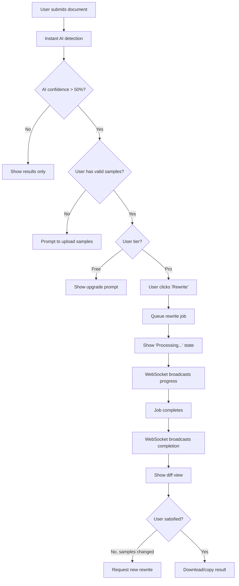

# Text Rewriting Flow

## Overview

The rewriting process transforms AI-generated text into human-like content using the user's writing samples as a style guide. This is an **async process** using Laravel queues with **real-time updates** via WebSocket.

## User Flow



## Rewriting Process

### Step 1: Validation

**Before queuing the rewrite job**:

```php
class RewritingService
{
    public function requestRewrite(Document $document, User $user): Rewrite
    {
        // Check user tier
        if ($user->tier !== 'pro') {
            throw new InsufficientTierException('Rewriting requires Pro tier');
        }
        
        // Check for valid samples
        $samples = $this->sampleRepository->getValidSamplesForUser($user);
        
        if ($samples->count() < 3) {
            throw new InsufficientSamplesException('Minimum 3 valid samples required');
        }
        
        if ($samples->count() > 6) {
            $samples = $samples->take(6); // Use only first 6
        }
        
        // Check if rewrite already in progress
        if ($document->hasActiveRewrite()) {
            throw new RewriteInProgressException();
        }
        
        // Create rewrite record
        $rewrite = $this->rewriteRepository->create([
            'document_id' => $document->id,
            'sample_ids' => $samples->pluck('id')->toArray(),
            'status' => 'queued',
            'queued_at' => now(),
        ]);
        
        // Dispatch job
        RewriteDocumentJob::dispatch($rewrite);
        
        // Broadcast queued event
        broadcast(new RewriteQueued($rewrite));
        
        return $rewrite;
    }
}
```

### Step 2: Queue Job

**Job structure**:

```php
class RewriteDocumentJob implements ShouldQueue
{
    use Dispatchable, InteractsWithQueue, Queueable, SerializesModels;
    
    public function __construct(
        public Rewrite $rewrite
    ) {}
    
    public function handle(
        RewritingServiceInterface $rewritingService
    ): void {
        try {
            // Update status
            $this->rewrite->update(['status' => 'processing']);
            broadcast(new RewriteProcessing($this->rewrite));
            
            // Get document and samples
            $document = $this->rewrite->document;
            $samples = Sample::findMany($this->rewrite->sample_ids);
            
            // Perform rewrite
            $result = $rewritingService->rewrite(
                originalText: $document->content,
                samples: $samples
            );
            
            // Generate diff
            $diff = $this->generateDiff(
                $document->content,
                $result->rewrittenText
            );
            
            // Save result
            $this->rewrite->update([
                'rewritten_content' => $result->rewrittenText,
                'diff' => $diff,
                'status' => 'completed',
                'completed_at' => now(),
            ]);
            
            // Update document status
            $document->update(['status' => 'completed']);
            
            // Broadcast completion
            broadcast(new DocumentRewritten($this->rewrite));
            
        } catch (\Exception $e) {
            $this->rewrite->update(['status' => 'failed']);
            broadcast(new RewriteFailed($this->rewrite, $e->getMessage()));
            throw $e;
        }
    }
    
    public function failed(\Throwable $exception): void
    {
        $this->rewrite->update(['status' => 'failed']);
        broadcast(new RewriteFailed($this->rewrite, $exception->getMessage()));
    }
}
```

### Step 3: AI Service Integration (Gemini)

**Decoupled service implementation**:

```php
interface RewritingServiceInterface
{
    public function rewrite(string $originalText, Collection $samples): RewritingResult;
}

class GeminiRewritingService implements RewritingServiceInterface
{
    public function __construct(
        private Client $client
    ) {}
    
    public function rewrite(string $originalText, Collection $samples): RewritingResult
    {
        // Build prompt with samples
        $prompt = $this->buildPrompt($originalText, $samples);
        
        // Call Gemini API
        $response = $this->client->generateContent([
            'contents' => [
                ['parts' => [['text' => $prompt]]]
            ],
            'generationConfig' => [
                'temperature' => 0.7,
                'maxOutputTokens' => 2048,
            ]
        ]);
        
        $rewrittenText = $response->text();
        
        return new RewritingResult(
            rewrittenText: $rewrittenText,
            metadata: [
                'model' => 'gemini-pro',
                'tokens_used' => $response->usageMetadata->totalTokenCount,
                'samples_used' => $samples->count(),
            ]
        );
    }
    
    private function buildPrompt(string $originalText, Collection $samples): string
    {
        $sampleTexts = $samples->map(fn($s) => $s->content)->join("\n\n---\n\n");
        
        return <<<PROMPT
You are a writing assistant. Rewrite the following text to sound more human and natural, using the writing style from the provided samples.

WRITING STYLE SAMPLES (study these carefully):
{$sampleTexts}

ORIGINAL TEXT TO REWRITE:
{$originalText}

INSTRUCTIONS:
1. Analyze the writing style, tone, vocabulary, and sentence structure from the samples
2. Rewrite the original text to match that style
3. Maintain the core meaning and information
4. Make it sound natural and human-written
5. Vary sentence length and complexity like in the samples
6. Use similar vocabulary choices and expressions

REWRITTEN TEXT:
PROMPT;
    }
}
```

### Step 4: Diff Generation

**Generate visual diff for UI**:

```php
private function generateDiff(string $original, string $rewritten): array
{
    // Use a diff library (e.g., sebastian/diff)
    $differ = new Differ(new UnifiedDiffOutputBuilder());
    $diff = $differ->diff($original, $rewritten);
    
    // Parse into structured format
    return [
        'additions' => substr_count($diff, '+'),
        'deletions' => substr_count($diff, '-'),
        'changes' => $this->parseDiffChanges($diff),
        'similarity_percentage' => $this->calculateSimilarity($original, $rewritten),
    ];
}

private function parseDiffChanges(string $diff): array
{
    // Parse unified diff into structured changes
    // Return array of change objects for UI rendering
    return [
        [
            'type' => 'replace',
            'original' => 'In today\'s digital landscape',
            'rewritten' => 'These days in the tech world',
            'line' => 1,
        ],
        // ... more changes
    ];
}
```

## Sample Change Detection

**Users can only request new rewrite if samples change**:

```php
class RewritingService
{
    public function canRequestNewRewrite(Document $document, User $user): bool
    {
        $lastRewrite = $document->rewrites()->latest()->first();
        
        if (!$lastRewrite) {
            return true; // No previous rewrite
        }
        
        $currentSampleIds = $this->sampleRepository
            ->getValidSamplesForUser($user)
            ->pluck('id')
            ->sort()
            ->values()
            ->toArray();
        
        $previousSampleIds = collect($lastRewrite->sample_ids)
            ->sort()
            ->values()
            ->toArray();
        
        // Allow if samples changed
        return $currentSampleIds !== $previousSampleIds;
    }
}
```

## Queue Configuration

**Dedicated queue for rewriting**:

```php
// config/queue.php
'connections' => [
    'database' => [
        'driver' => 'database',
        'table' => 'jobs',
        'queue' => 'default',
        'retry_after' => 90,
    ],
],

// Job dispatch
RewriteDocumentJob::dispatch($rewrite)->onQueue('rewrites');
```

**Worker command**:
```bash
php artisan queue:work --queue=rewrites --tries=3 --timeout=120
```

## Error Handling

### API Failures
- Retry 3 times with exponential backoff
- If all retries fail, mark as 'failed'
- Broadcast failure event to user
- Log error for admin review

### Timeout
- Set job timeout to 120 seconds
- If exceeded, mark as 'failed'
- User can retry manually

### Invalid Response
- Validate AI response format
- If invalid, retry once
- If still invalid, mark as 'failed'

## Rate Limiting

**Per-user limits**:

```php
class RewritingService
{
    public function checkRateLimit(User $user): void
    {
        $limit = $user->tier === 'pro' ? 50 : 0; // Free tier: 0 rewrites
        
        $count = $this->usageRepository->countRewritesToday($user);
        
        if ($count >= $limit) {
            throw new RateLimitExceededException(
                "Daily limit of {$limit} rewrites exceeded"
            );
        }
    }
}
```

## Testing Strategy

```php
test('queues rewrite job for pro user with valid samples', function () {
    Queue::fake();
    
    $user = User::factory()->create(['tier' => 'pro']);
    $document = Document::factory()->for($user)->create();
    Sample::factory()->count(3)->for($user)->create(['is_valid' => true]);
    
    $this->rewritingService->requestRewrite($document, $user);
    
    Queue::assertPushed(RewriteDocumentJob::class);
});

test('throws exception for free tier user', function () {
    $user = User::factory()->create(['tier' => 'free']);
    $document = Document::factory()->for($user)->create();
    
    expect(fn() => $this->rewritingService->requestRewrite($document, $user))
        ->toThrow(InsufficientTierException::class);
});

test('prevents new rewrite if samples unchanged', function () {
    $user = User::factory()->create(['tier' => 'pro']);
    $document = Document::factory()->for($user)->create();
    $samples = Sample::factory()->count(3)->for($user)->create();
    
    // First rewrite
    $rewrite = Rewrite::factory()->create([
        'document_id' => $document->id,
        'sample_ids' => $samples->pluck('id')->toArray(),
    ]);
    
    expect($this->rewritingService->canRequestNewRewrite($document, $user))
        ->toBeFalse();
});
```

## Performance Monitoring

Track metrics:
- Average rewrite time
- Success/failure rate
- API token usage
- Queue depth
- User satisfaction (implicit: re-rewrite rate)
